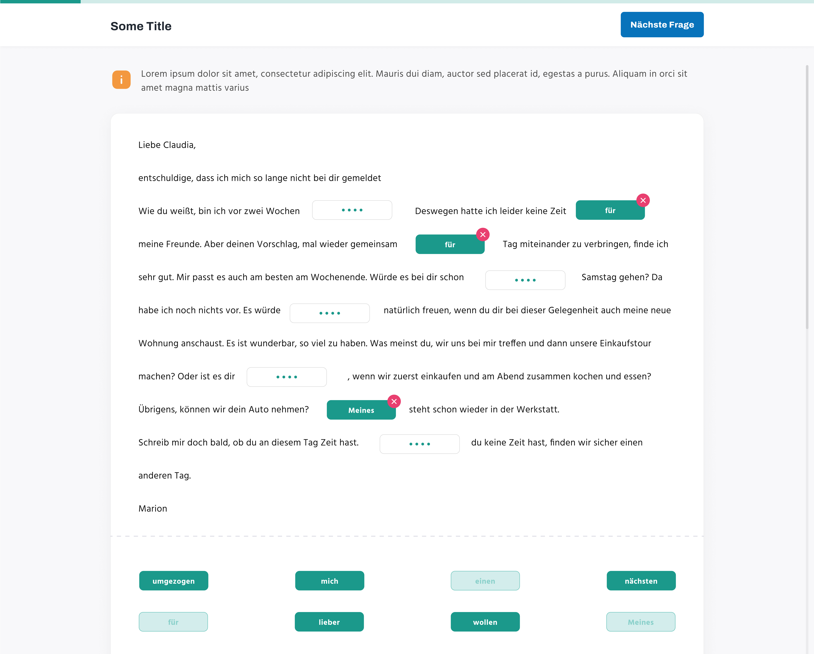

## Work process

Create a copy of this repository and complete the task in your repository. 
When the task is complete add these accounts as collaborators: `armen9494`, `cripalani`.

## Installation

### Backend

Install all the dependencies using composer

```
composer install
```

Copy the example env file and make the required configuration changes in the .env file

```
cp .env.example .env
```

Generate a new application key

```
php artisan key:generate
```

Set the database connection in `.env`.

Run the database migrations with seeds.

```
php artisan migrate:fresh --seed
```

### Frontend

Install all packages using npm

```
npm install
```

Run

```
npm run dev
```

## Task description

This is an evaluation test for German. There are open gap fields (four dots) in the text and below are possible answers. 
User needs to put the correct answer to the correct place.

The user must be able to put the answer to the open gap field using two options:
- drag the answer and drop it into the open gap field  
- click on the answer and then click on the field that he wants to put in.

All other parts (like you need to be able to deselect an answer or the already selected answer must be inactive at the bottom panel) 
are intuitively clear from this image.



You can download the text from this file: [Task.md](docs/Task.md)
